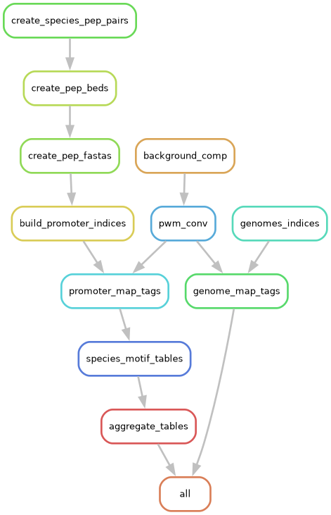

# Istruzioni
Guida per le varie rule del file di snakemake ottimizzato per lo studio di tutti i motivi associati alle varie specie.

## Creazione Orthogroups_DISCO.tsv
Essendo che nella nostra pipeline di lavoro abbiamo eseguito DISCO per eliminare tutti gli ortogruppi contenenti geni paraloghi, si è optato per la generazione di un file contenent e la proteina associata ad ogni specie che ritroviamo in un ortogruppo specifico (analogo del file `Orthogroups.tsv`)
```bash
awk 'BEGIN {FS = "|"; OFS = "\t"} FNR == 1 {og = FILENAME; gsub(".*/", "", og); gsub(".faa", "", og)} /^>/ {split(substr($0, 2), parts, "|"); sp = parts[1]; gene = parts[2]; data[og, sp] = gene; ogs[og] = 1; spp[sp] = 1} END {header = "Orthogroup"; for (sp in spp) {header = header OFS sp; col_order[++n] = sp} print header; for (og in ogs) {row = og; for (i = 1; i <= n; i++) {sp = col_order[i]; if ((og, sp) in data) {row = row OFS data[og, sp]} else {row = row OFS ""}} print row}}' *.faa > Orthogroups_DISCO.tsv
```

## Snakemake's rules
In totale per eseguire la pipeline di lavoro completa sono state eseguite 12 differenti rule di snakemake, riassunte nelle seguenti informazioni:

***Rule create_species_pep_pairs***:
Questa rule è stata utilizzata per creare dei file tsv che contenessero all’interno la prima colonna con solo ed unicamente il nome della specie (abbreviativo della specie) e la seconda colonna contenente tutte le proteine associate a quella specie contenute dentro il file di annotazione strutturale gff3.

***Rule create_pep_beds***:
In questa rule vengono creati tutti i file BED (ovvero contenenti 6 colonne) dentro i quali vengono riportati solamente gli “mRNA” che sono stati estratti dal file gff3 ed ai quali sono state associate le informazioni relative allo scaffold sul quale si collocano e la posizione nucleotidica del trascritto.

***Rule create_pep_fasta***:
Una volta ottenuti i file precedenti si possono associare le sequenze nucleotidiche (prese direttamente dai genomi delle specie) a ciascun “mRNA” identificato con la rule precedente.

***Rule build_promoter_indices***:
Questa sezione dello snakemake file consente di andare a creare un indice (suddiviso in sei differenti file) di tutti i promotori che sono stati identificati. Questo procedimento di indicizzazione è stato eseguito con il programma Bowtie v1 (non la v2). 

***Rule genomes_indices***:
Lo stesso procedimento adottato per l’indicizzazione dei promotori, è stato adoperato persino per tutti i genomi. Quindi analogamente al precedente è stato impiegato Bowtie v1.

***Rule background_comp***:
In questa sezione è stato utilizzato il programma seq_extract_bcomp (proveniente da PWMScan) per creare un background di riferimento per ogni specie. Ovvero, viene creato un file contenente l’abbondanza delle varie basi azotate all’interno del genoma espressi in percentuale.

***Rule pwm_convert***:
Questa rule rappresenta una delle più importanti rule adoperate dentro lo script snakemake. La sua funzionalità risiede proprio nella ricostruzioni e adattamento delle sequenze dei motivi (ottenute dal database online JASPAR 2026 CORE) seguendo le caratteristiche del genoma delle specie, mediante l’utilizzo della composizione background delle medesime. L’operazione sostanziale eseguita in questa rule è la conversione della matrice di frequenza in una matrice probabilistica perfettamente adattata alle caratteristiche del genoma analizzato. (Vengono definiti come tags i motivi riadattati alle specie del dataset)

***Rule genome_map_tags***:
Una volta ottenuti tutti e 300 i possibili motivi individualizzati ad hoc per ciascuna specie, si prosegue con la fase di mappatura dei medesimi motivi sul genoma di riferimento. Procedimento eseguito con l’utilizzo del genoma indicizzato e dei tag ovviamente.

***Rule promoter_map_tags***:
Analogamente I tags vengono mappati e collocati sulle sequenze promotrici mediante gli indici dei promotori ottenuti precedentemente. (Procedimento concettualmente identico alla rule precedente)

***Rule genome_motif_tables***:
Viene costruita una tabella a partire dalle informazioni estratte dalla mappatura dei motivi sul genoma e vengono calcolate alcune sattistiche che indicano la compatibilità del motivo con la sequenza associata. La "conta" esprime il quantitativo di volte che quello specifico motivo viene identificato dentro lo scaffold indicato, mentre la "media" consente di capire la robustezza media di quell'appaiamento.

***Rule species_motif_tables***:
In questa rule vengono eseguite le medesime operazione fatte nella precedente rule, con la singola differenza che qui si valuta l'appaiamento del motivo sulle sequenze promotrici e non sul complressivo genoma.

***Rule aggregate_tables***:
Essendo che vengono utilizzati tutti i file .gff3 provenienti dalle annotazioni GAGA, ritroviamo all'interno una sintassi delle proteine non ancora standardizzata (ovvero con il nome dell'abbreviativo GAGA dentro al nome). Per questo motivo viene eliminato il nome dell'abbreivativo lasciando il semplice nome del peptide, per consentire l'appaiamento corretto con il nome del peptide ritovabile nel Ortogruppo di riferimento (nome già standardizzato precedentemente).
Il risultato finale consiste nella generazione di una singola tabella per ogni motivo associato ad una singola specie, che consente di verificare quali sono gli ortogruppi associati a quello specifico motivo.

<p align="center">
  
</p>
